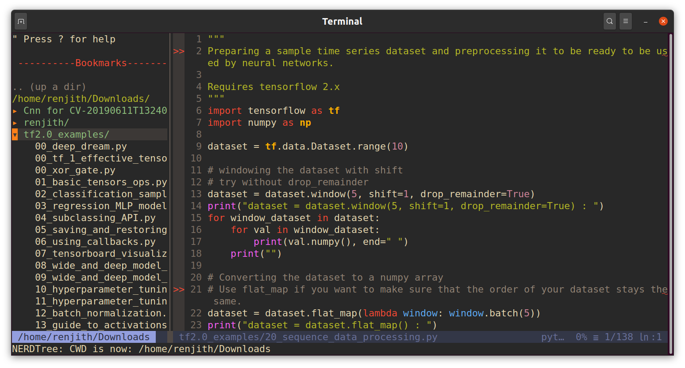
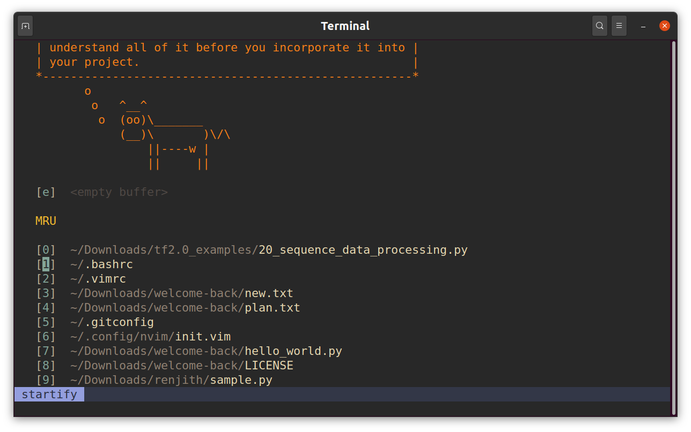
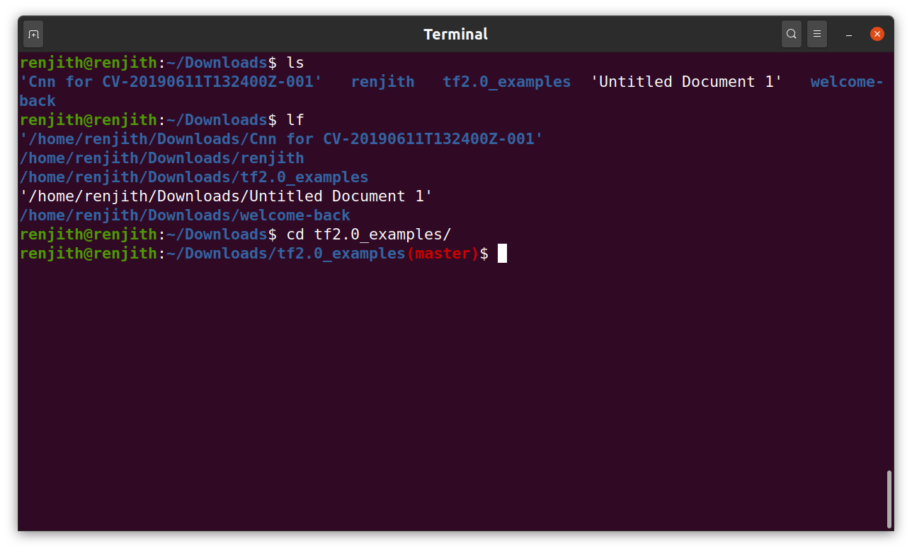

### neovim Configuration for Python 
neovim configuration for python in Ubuntu
Tested and working fine on Ubuntu 20.04, python 3.8

### Steps

* Install neovim - https://github.com/neovim/neovim/wiki/Installing-Neovim (recommend building from source)
* Install the vim pluggin manager, vim-plug - https://github.com/junegunn/vim-plug
* install the required python libraries in the base environment
```shell
pip install pynvim --upgrade flake8 black jedi
```
* copy the init.vim file to ~/.config/nvim/init.vim
* start the neovim by caling nvim from terminal
* Install the pluggins that are added in the init.vim file by running the following from nvim
```shell
<esc> :PlugInstall <enter>
```
* restart and run nvim!

For installation, please refer https://www.youtube.com/watch?v=YZVgKEiYp9k


### Bonus 1 - Adding git branch name to the ubuntu terminal prompt

Add the following to the *~/.bashrc* file and then run *source ~/.bashrc* from terminal

```shell
# Show git branch name
force_color_prompt=yes
color_prompt=yes
parse_git_branch() {
 git branch 2> /dev/null | sed -e '/^[^*]/d' -e 's/* \(.*\)/(\1)/'
}
if [ "$color_prompt" = yes ]; then
 PS1='${debian_chroot:+($debian_chroot)}\[\033[01;32m\]\u@\h\[\033[00m\]:\[\033[01;34m\]\w\[\033[01;31m\]$(parse_git_branch)\[\033[00m\]\$ '
else
 PS1='${debian_chroot:+($debian_chroot)}\u@\h:\w$(parse_git_branch)\$ '
fi
unset color_prompt force_color_prompt
```

### Bonus 2 - Adding an alias "lf" for listing full path

Add the following in the *~/.bashrc"

```shell
alias lf='ls -d -1 "$PWD"/*
```


### Sample screenshots






